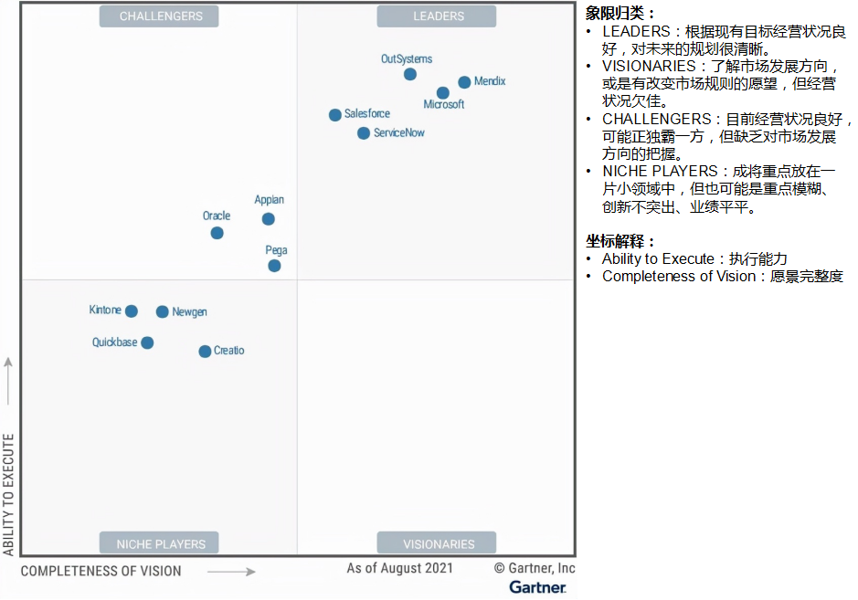

## 工具


### 低代码

按代码量的维度来分类
- 纯代码(Pro Code)
- 低代码(Low Code)
- 无代码(Node Code)

按适用范围的维度分：专用型和通用型
按输出的 App 的类型来分类：
- 流程驱动型：流程审批，简单业务编排，简单数据编排
- 表单驱动型：调查问卷，线上考试，流程审批，简单报表
- 模型驱动型：CRUD类APP
- BI分析类型：专业报告/报表，专业数据分析
按使用者的类型来分类
- 专业技术人员
- 业务技术人员
- 无专业技能人员

头部分析机构 Forrester，Gartner，艾瑞咨询

现在低代码头部解决方案中已经有类似 OutSystem、Microsoft 这样的通用型低代码巨无霸
  


### Node.js

### Webpack

#### Webpack 构建流程


Webpack 的构建流程简单来说就是递归编译每一个模块文件，对于不同类型的文件使用不同的 webpack loader 进行处理。我们要做的就是就是将 webpack 中做代码转化的步骤(babel-loader, ts-loader) esbuild-loader 代替。

### Esbuild
ESbuild 是一个类似webpack构建工具。它的构建速度是 webpack 的几十倍。

#### 为什么这么快 ？
- 1.js是单线程串行， Esbuild 是新开一个进程，然后多线程并行，充分发挥多核优势;
- 2.go是纯机器码，肯定要比JIT快;
- 3.不使用 AST，优化了构建流程;

#### Esbuild 的缺点


---

### Google V8 学习

#### 为什么要先编译再执行？
CPU可以看成是一个小的运算器，可以通过二进制指令和CPU进行沟通。
比如“1000100111011000”的二进制指令，这条指令的意思是将一个寄存器中的数据移动到另外一个寄存器中，当处理器执行到这条指令的时候，便会按照指令的意思去实现相关的操作。

复杂的任务是由一大堆指令来实现的。这一大堆指令成为**指令集（Instructions）**，也就是**机器语言**。
CPU 只能识别二进制的指令，但是对程序员来说，二进制代码难以阅读和记忆，于是我们又将二进制指令集转换为人类可以识别和记忆的符号，这就是**汇编指令集**。

```
1000100111011000  机器指令
mov ax,bx         汇编指令
```

CPU 不能识别汇编语言，因此需要**汇编解释器**，将汇编代码编程成机器指令。但是汇编语言复杂且繁琐。不同的CPU有着不同的指令集。（Intel， ARM， MIPS）。

和汇编语言一样，处理器也不能直接识别由高级语言所编写的代码。通常，要有两种方式来执行这些代码。
- 第一种是解释执行，需要先将输入的源代码通过**解析器编译**成中间代码，之后直接使用**解释器**解释执行中间代码，然后直接输出结果。
- 第二种是编译执行。先将源代码**转换**为中间代码，然后我们的**编译器**再将中间代码编译成机器代码。


#### V8 是怎么执行 JavaScript 代码的？
V8 并没有采用某种单一的技术，而是混合编译执行和解释执行这两种手段。这种混合使用编译器和解释器的技术称为 JIT（Just In Time）技术。

解释执行的启动速度快，但是执行时的速度慢，而编译执行的启动速度慢，但是执行时的速度快。

下面完整的 V8 执行 JavaScript 的流程图：

在 V8 启动执行 JavaScript 之前，它还需要准备执行 JavaScript 时所需要的一些基础环境,包括了“堆空间”“栈空间”“全局执行上下文”“全局作用域”“消息循环系统”“内置函数”等。
- **JavaScript 全局执行上下文**就包含了执行过程中的全局信息，比如一些内置函数，全局变量等信息；
- **全局作用域**包含了一些全局变量，在执行过程中的数据都需要存放在内存中；
- V8 是采用了经典的堆和栈的内存管理模式，所以 V8 还需要初始化内存中的堆和栈结构；
- 初始化**消息循环系统**，消息循环系统包含了消息驱动器和消息队列;

要执行的 JavaScript 源代码， 对 V8 来说只是一堆字符串，需要结构化这段字符串。V8 源代码的结构化之后，就生成了抽象语法树 (AST)，我们称为 AST，AST 是便于 V8 理解的结构。

有了 AST 和作用域之后，接下来就可以生成字节码了， **字节码**是介于 AST 和机器代码的中间代码。解释器可以**直接解释执行字节码**，或者通过编译器将其编译为二进制的机器代码再执行。

生成了字节码之后，解释器就登场了，它会按照顺序解释执行字节码，并输出执行结果。

监控解释器执行状态的模块，在解释执行字节码的过程中，如果发现了某一段代码会被重复多次执行，那么监控机器人就会将这段代码标记为热点代码。

```
可以使用 jsvu 来安装 js 引擎

1. 全局安装 jsvu： npm install jsvu -g
2. 将~/.jsvu路径添加到系统环境变量中：export PATH="${HOME}/.jsvu:${PATH}"
3. 可以直接通过命令参数指定： jsvu --os=mac64 --engines=v8-debug。
```

#### JavaScript 设计思想

#### V8的基础环境
#### 编译流水线

#### 事件循环系统

#### 垃圾回收机制


---
### Windows
### Mac

7z文件解压缩
```sh
brew update
brew install p7zip

## Unzip
7z x myfiles.7z
## Compress
7z a myfiles.7z myfiles
```


JavaScript引擎: Mozilla/SpiderMonkey, Google/V8, JavaScriptCore 等。

- Chrome
  - 基于 V8
- Node.js
  - nodejs是基于 V8 和 Libuv 的
- Google V8
  - 即时编译（JIT）
  - 惰性编译
  - 内联缓存
  - 隐藏类等机制
- Libuv
  - 是一个跨平台的的基于事件驱动的异步IO库
  - [Network I/O, File I/O, DNS Ops., User code](http://docs.libuv.org/en/v1.x/design.html)
  - 用于抽象 Windows 的 IOCP 及 Unix 的 Libev
- Libevent
- Libev
  - 较libevent而言，设计更简练，性能更好，但对Windows支持不够好
- IOCP, Input/Output Completion Port
  - Windows

### JIT技术
- JVM
- luajit
- Dart VM
- graalVM
- PHP -> https://wiki.php.net/rfc/jit
- HotSpot
- Dalvik -> https://android-developers.googleblog.com/2010/05/dalvik-jit.html
- PyPy
- Ruby 2.6+

### AOT模式
---

### Deno

Deno放弃Go换用Rust重写并发布v0.1

---

## Web
Web3.0

## 编程语言与编程工具


- 静态类型语言 dynamic typing language
  - C
  - C++
  - Java
  - C#
  - D
  - VB
  - Delphi
- 动态类型语言 staic typing language
  - Perl
  - PHP
  - Python
  - Ruby
  - JavaScript
  - Groovy
  - Scala
- 强类型
- 弱类型

### HTML

- `<canvas>`
- `<audio>`、`<video>`
- Geolocation
- DOM Storage
- Web SQL Database
- Web Worker

### CSS
### SCSS
### PostCss
### JavaScript
### Node
### NPM
### Vue
### React
### ESLint
### Babel
### Docker
### Java
### Jenkins
### Rancher
### Go
### Rust
### C
C89, 1990
AMD1, 1995
C99, 1999
C11, 2011

.h 文件是C/C++的头文件，只放入函数声明，宏定义，函数原型。

### Kubenet
### PHP
### Laravel
### Lumen


## STANDARDS 标准
- W3C 标准
  - CSS
  - SVG
  - WOFF
  - 语义Web
  - XML和各类应用编程接口（APIs）
- CGI
- FastCGI

## 协议

### 网络协议

## 组织
- W3C, World Wide Web Consortium 万维网联盟
  - W3C的设计原则（Principles）是：Web for All，Web on Everything
## 软件/程序/应用

### 软件架构
后端：高可用，可伸缩的架构设计
前端：渐进式，高复用

- 软件的可伸缩性 scalability
    - 指从容应对工作量增长的能力


- 常见软件架构
  - 分层模式
  - 客户服务器模式（CS）
  - 主从模式
  - 管道过滤器模式
  - 代理模式
  - P2P模式
  - 事件总线模式
  - MVC模式
  - 黑板模式
  - 解释器模式

所有的设计， 最终就是要应对变化，什么变化？

- 渐进式架构
- PAAS架构
- MVP
- MVC
- MVVM
- BFF

- OOA, Object-Oriented Architecture
- COA, Component- Oriented Architecture
- SOA, Service-Oriented Architecture） Architecture
- EDA, Event-Driven Architecture
- MDA, Model Driven Architecture
## 软件设计模式

### 抽象
- 过程抽象 proceduaral abstraction
    - 运算，函数，将行为的逻辑属性与实现细节分离
- 数据抽象 data abstraction
    - 类型，抽象数据类型，将数据的逻辑属性与表示细节分离
- 迭代抽象 iteration abstration
    - 抽象引入循环，抽象结果：迭代器，抽象目的：将集合遍历与元素获取细节分离
- 类型层级 type hierarchy
    - 抽象引入类族，抽象结果，类型层级结构，抽象目的：将类型家族的公共行为与具体类型分析
- 多态抽象 polymorphic abstraction
    - 抽象引入：多态类型
    - 抽象结果：抽象类型、参数类型
    - 抽象目的：将类型与算法分离；

### 数据抽象
ADT abstraction data type

### 设计原则 SOLID
- SRP Single Responsibility Principle 单一职责
    - 一个类应当只有一个变更的理由
- OCP Open Closed Principle 开闭原则 
    - 软件实体应对扩展开放，对修改封闭
- LSP Liskov Substitution Principle 里氏替换原则
    - 子类型必须能替代超类型
- LKP Least Knowledge Principle 迪米特原则
    - 
- ISP Interface Segregation Principle 接口隔离职责
    - 不应强迫客户依赖那些他们不用的方法
- DIP Dependence Inversion Principle 依赖倒置原则
  - 高层模块不应依赖底层模块，他们都应依赖抽象；
  - 抽象不应该依赖细节，细节应该依赖抽象；

### 设计模式(23种)
- 创建模式 7
  - 工厂模式
  - 原型模式
  - 单利模式
  - 对象池模式
  - 建造者模式
- 结构模式 8
    - 桥梁模式
    - 适配器模式
    - 装饰着而漠视
    - 代理模式
    - 外观模式
    - 复合模式
    - 享元模式
- 行为模式 11
    - 职责链模式
    - 命令模式
    - 观察者模式
    - 中介者模式
    - 状态模式
    - 备忘录模式
    - 访客者模式
    - 迭代器模式
    - 解释器模式

### OOP 面向对象
- 关键在于构造对象

- IOC 控制反转
  - 谁反了？
  - 谁是控制一方？
  - 谁是被控一方，现实生活中，有相关的案例吗？ 
  - 主要作用：降低模块之间的依赖性，从而降低模块的耦合度和复杂度，提高软件的可重用性、柔韧性和可扩展性。

- DI, Dependency Injection 依赖注入
    - 动态地为一个软件组件提供外部依赖·

- callback 回调


## 编程语言特性
- 类型
- autoboxing/unboxing: 自动装箱和拆箱就是将基本数据类型和包装类之间进行自动的互相转换
    - JDK1.5后，Java引入了自动装箱(autoboxing)/拆箱(unboxing)
- 闭包
- 逻辑
- 顺序/选择/循环
- Generic 泛型
- 双向绑定
- 单向数据流


- LOP 
  - 关键在于构造语言的语法
- DSL
  - HQL（Hibernate Query Language）是典型的DSL
- 模板
- 命令


## Language Pattern 编程语言范式
  - 命令范式
  - 声明范式
  - 对象范式
  - 并发范式
  - 函数范式
  - 逻辑范式
  - 过程范式
  - 泛型范式
  - 汇总范式
  - 情景范式

### 函数范式


- 函数式没有成为主流，至少有两方面的原因：
  - 主观上，程序员更习惯机器风格的过程式思维和现实风格的OOP思维，不容易接纳数学风格的函数式思维；
  - 客观上，函数式语 言在表现力和运行效率[8]等方面与过程式和OOP语言也有一定差距。

惰性求值

### 逻辑范式
算法=逻辑+控制。其中逻辑是算法的核心，控制主要用于改进算法 的效率。

- 逻辑式语言Prolog
  - Prolog代码是由一系列事实（fact）、规则 （rule）和查询（query）语句组成的

### 元编程
  - 试试编写、操纵程序的程序。
  - 例子
    - IDE 通过向导、拖放控件的方式自动生成源代码；
    - UML建模工具将类图转换为代码；
    - Servlet引擎将JSP转换为Java代码；
    - Spring、Hibernate、XDoclet 等框架和工具能从配置文件、anotation/attribute 中产生代码；

### 切面范式 -- 多角度看问题
  - 横看成岭侧成峰。 苏轼·题西林壁
  - key: SoC; DRY; AOP; Aspect; join point; pointcut; advice; OOP
  - 问题
    - 什么是横切关注点？
    - 接入点与切入点有何区别？
    - 什么是编织？有哪些编织方法？
    - 实施AOP有哪些步骤？
    - 为什么说AOP是OOP的一种补充？
    - 为什么提倡尽可能阅读原文的书籍和资料？
  - weaving 编织
  - https://www.cnblogs.com/xyz98/archive/2009/03/20/1417919.html

- 抽象是前提，分解是方式，模块化是结果
  - 抽象与分离的原则：单一化，正交化。
  - 高内聚低耦合：每个模块职责负责单一，模块与模块之间相互独立
- DRY, Dont Repeat Yourself 尽量减少重复代码
- SoC, Separation of Concerns 关注点分离原则


### event事件驱动
  - polling 轮询, 是流程驱动的，符合常规的流程驱动式编程的模式。
  - notifacation 通知, 是事件驱动的，符合事件驱动式编程的模式。
  - 基于事件驱动的系统一般提供两类的内置事件
    - 一类是底层事件 low-level/native event
    - 一类是语义事件 semantic event
  - event handler: 负责处理事件
  - event listener
  - event loop
  - 如何设计事件机制？
    - 括事件定义
    - 事件触发
    - 事件侦查
    - 事件转化
    - 事件合并
    - 事件调度
    - 事件传播
    - 事件处理
    - 事件连带 event cascade


### 汇总范式

## 算法

### 排序

### 快速排序

思想：在列表中找一个基准元素，将所有小于它的元素划归一个子列，置于其前；将所有大于等于它的元素划归另一子列，置于其后。然后递归 地对前后两个子列作同样处理，直至最终。

### 指令集
Intel主要有x86，MMX，SSE，SSE2，SSE3，SSSE3 (Super SSE3)，SSE4A，SSE4.1，SSE4.2，AVX，AVX2，AVX-512，VMX等指令集。

### Developer

- Ryan Dahl
  - Google Brain 团队的软件工程师
  - 是 Node.js/deno 作者